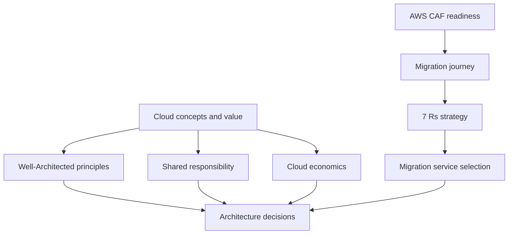

# Cloud Fundamentals

 

Start here to understand cloud value, responsibility boundaries, AWS design principles, cloud adoption, migration, and cloud economics.

This section provides the conceptual foundation for the rest of the repository. It is strongest for AWS Certified Cloud Practitioner and provides the architecture vocabulary needed before studying Solutions Architect – Associate services and patterns.

## What You Will Learn

After completing this section, you should be able to:

- explain the AWS Cloud value proposition and the six common cloud advantages;
- distinguish agility, elasticity, scalability, high availability, and fault tolerance;
- compare service models and deployment models;
- apply the AWS shared responsibility model to EC2, RDS, Lambda, and S3 scenarios;
- identify the six AWS Well-Architected pillars and use them in basic design reasoning;
- explain the six AWS CAF perspectives and cloud-transformation outcomes;
- describe the assess, mobilize, and migrate-and-modernize journey;
- distinguish the 7 Rs of migration;
- select basic discovery, application, database, online-transfer, offline-transfer, and tracking services;
- explain fixed versus variable costs, rightsizing, automation, economies of scale, BYOL, and license-included models.

## Recommended Study Order

| Order | Topic | What it covers |
|---:|---|---|
| 1 | [Cloud Concepts and Benefits](02-cloud-concepts-and-benefits.md) | Cloud definition, agility, elasticity, scalability, availability, economics, service models, and deployment models. |
| 2 | [Cloud Value and AWS Design Principles](03-cloud-value-and-design-principles.md) | Six cloud advantages and the general principles that turn cloud capabilities into useful outcomes. |
| 3 | [AWS Shared Responsibility Model](01-shared-responsibility-model.md) | Security and operational responsibilities divided between AWS and the customer. |
| 4 | [AWS Well-Architected Framework Fundamentals](04-well-architected-framework-fundamentals.md) | Six pillars, review process, pillar differences, and architecture trade-offs. |
| 5 | [AWS Cloud Adoption Framework](05-aws-cloud-adoption-framework.md) | Six organizational perspectives, transformation readiness, and expected business outcomes. |
| 6 | [Cloud Migration Journey and the 7 Rs](06-cloud-migration-journey-and-7-rs.md) | Assess, mobilize, migrate and modernize, migration waves, and workload strategies. |
| 7 | [AWS Migration Service Selection](07-migration-service-selection.md) | Discovery, application migration, database replication, schema conversion, online transfer, offline transfer, and tracking. |
| 8 | [Cloud Economics and Licensing](08-cloud-economics-and-licensing.md) | Total cost, fixed and variable costs, rightsizing, automation, BYOL, license included, License Manager, and Dedicated Hosts. |
| 9 | [Cloud Fundamentals Review](09-cloud-fundamentals-review.md) | Comparison tables, scenario questions, answer explanations, and readiness checklist. |

## Official Exam Alignment

### AWS Certified Cloud Practitioner (CLF-C02)

This section supports:

- **Domain 1: Cloud Concepts** — cloud benefits, design principles, migration, AWS CAF, and cloud economics;
- **Domain 2: Security and Compliance** — the shared responsibility model.

Cloud Concepts represents 24% of CLF-C02 scored content, while Security and Compliance represents 30%. The rest of those domains is covered across later security, governance, service, billing, and exam-preparation sections.

### AWS Certified Solutions Architect – Associate (SAA-C03)

This section provides foundational vocabulary and reasoning. SAA requires deeper application of:

- secure architecture;
- resilient architecture;
- high-performing architecture;
- cost-optimized architecture;
- AWS Well-Architected trade-offs.

Continue to the service categories and [Architecture and Design Patterns](../13-architecture-and-design-patterns/README.md) for SAA-level depth.

## Section Map

```text
01-cloud-fundamentals/
├── README.md
├── 01-shared-responsibility-model.md
├── 02-cloud-concepts-and-benefits.md
├── 03-cloud-value-and-design-principles.md
├── 04-well-architected-framework-fundamentals.md
├── 05-aws-cloud-adoption-framework.md
├── 06-cloud-migration-journey-and-7-rs.md
├── 07-migration-service-selection.md
├── 08-cloud-economics-and-licensing.md
└── 09-cloud-fundamentals-review.md
```

## How Topics Connect



- Cloud concepts explain **why** organizations use AWS.
- Shared responsibility explains **who operates and secures each layer**.
- Well-Architected explains **how to evaluate workload design**.
- AWS CAF explains **how the organization prepares for transformation**.
- The migration journey and 7 Rs explain **what change each workload needs**.
- Migration services explain **how applications and data can be discovered, moved, converted, replicated, or tracked**.
- Cloud economics explains **how to evaluate cost, consumption, operations, and licenses**.

## How to Study This Section

1. Read the lessons in the recommended order.
2. Write one sentence explaining the problem each concept solves.
3. Build comparison cards for commonly confused terms.
4. Complete every knowledge check without looking at the answers.
5. Explain each wrong answer, not only the correct answer.
6. Revisit the official AWS documentation for volatile service behavior, availability, pricing, quotas, and licensing rules.
7. Finish with the review lesson and repeat weak topics.

## High-Priority Comparisons

Make sure you can distinguish:

- agility versus elasticity;
- scalability versus elasticity;
- high availability versus fault tolerance;
- security of the cloud versus security in the cloud;
- Well-Architected Framework versus AWS CAF;
- rehost versus replatform versus refactor;
- DMS versus DataSync versus Snowball;
- discovery versus migration tracking;
- fixed versus variable costs;
- BYOL versus license included.

## Related Sections

- [Global Infrastructure](../02-global-infrastructure/README.md)
- [Migration and Hybrid Cloud](../11-migration-and-hybrid-cloud/README.md)
- [Billing, Pricing, and Support](../12-billing-pricing-and-support/README.md)
- [Architecture and Design Patterns](../13-architecture-and-design-patterns/README.md)
- [Comparisons and Decision Guides](../15-comparisons-and-decision-guides/README.md)
- [Exam Preparation](../16-exam-preparation/README.md)

## References

- [AWS Certified Cloud Practitioner CLF-C02 exam guide](https://docs.aws.amazon.com/aws-certification/latest/cloud-practitioner-02/cloud-practitioner-02.html)
- [CLF-C02 Domain 1: Cloud Concepts](https://docs.aws.amazon.com/aws-certification/latest/cloud-practitioner-02/cloud-practitioner-02-domain1.html)
- [CLF-C02 Domain 2: Security and Compliance](https://docs.aws.amazon.com/aws-certification/latest/cloud-practitioner-02/cloud-practitioner-02-domain2.html)
- [AWS Certified Solutions Architect – Associate SAA-C03 exam guide](https://docs.aws.amazon.com/aws-certification/latest/solutions-architect-associate-03.html)
- [AWS Well-Architected Framework](https://docs.aws.amazon.com/wellarchitected/latest/framework/welcome.html)
- [AWS Cloud Adoption Framework](https://aws.amazon.com/cloud-adoption-framework/)

Sources checked: **2026-08-01**.

[Repository home](../README.md)
