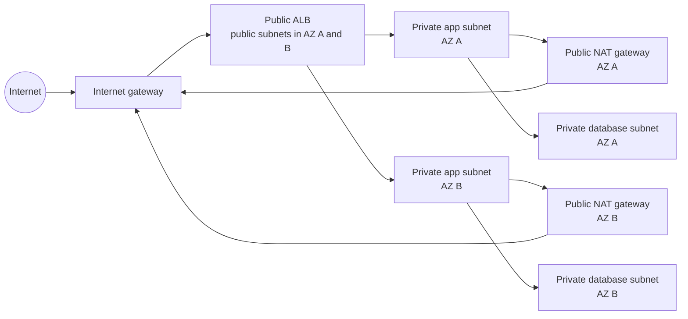

# Subnets, Route Tables, and Internet Connectivity

## Overview

Subnets place resources in Availability Zones. Route tables decide the next target for destination traffic. Internet, NAT, and egress-only internet gateways provide different public-egress behaviors.

The diagram separates public entry, private application tiers, and private database tiers. NAT gateways handle initiated outbound IPv4 traffic; they are not inbound application entry points.

## Public and Private Subnets

| Design | Route-table property | Typical resources | Internet behavior |
|---|---|---|---|
| Public subnet | Route such as `0.0.0.0/0` to an internet gateway | Internet-facing load balancer, public NAT gateway | IPv4 resources also need public addresses; rules must allow traffic |
| Private subnet with egress | No direct IGW route; default IPv4 route to a NAT gateway | Application servers, workers | Can initiate IPv4 internet connections; no unsolicited inbound sessions through NAT |
| Isolated subnet | No route to an internet or NAT gateway | Databases or restricted workloads | Only explicitly routed private destinations are reachable |
| IPv6 outbound-only subnet | `::/0` to an egress-only internet gateway | IPv6-enabled private workloads | Can initiate IPv6 internet connections without accepting new inbound sessions through the gateway |

A public IP does not make its subnet public. Conversely, an internet-gateway route does not automatically assign a public IP or permit traffic.

## Route Tables

- Every subnet is associated with one route table, explicitly or through the VPC's main route table.
- Multiple subnets can use the same route table.
- A route has a **destination** CIDR or prefix list and a **target**, such as an internet gateway, NAT gateway, network interface, VPC endpoint, peering connection, Transit Gateway, or virtual private gateway.
- Each route table contains local routing for VPC CIDRs.
- Custom route tables make public, private, application, and database paths explicit. Keeping the main table minimally permissive reduces accidental exposure of new subnets.
- Route propagation can add learned routes from supported VPN or gateway designs. Know the concept; do not assume every attachment propagates automatically.
- A route can become `blackhole` when its target is unavailable or removed. Matching traffic is then discarded.

## Route Evaluation

VPC routing uses the most specific matching route, often called longest-prefix match. A route to `10.20.4.0/24` is more specific than `10.20.0.0/16`, which is more specific than `0.0.0.0/0`.

Example:

| Destination | Target |
|---|---|
| `10.20.0.0/16` | local |
| `10.30.0.0/16` | peering connection |
| `10.40.0.0/16` | Transit Gateway |
| `0.0.0.0/0` | NAT gateway |

Traffic for `10.30.5.10` uses peering; traffic for `10.40.8.20` uses Transit Gateway; other IPv4 traffic uses NAT. IPv4 and IPv6 route families are evaluated separately.

## Internet Gateway

An internet gateway is a horizontally scaled, redundant, highly available VPC component. To use it:

1. Attach it to the VPC.
2. Add an appropriate route to the subnet route table.
3. For IPv4, give the resource a public IPv4 address or Elastic IP where supported.
4. Permit traffic through security groups, network ACLs, and host/application controls.

An internet gateway supports initiated inbound and outbound communication; it does not filter traffic by itself.

## NAT Gateway

A public NAT gateway is created in a public subnet, uses an Elastic IP, and reaches the internet through the VPC internet gateway. Private-subnet route tables point their IPv4 default route to the NAT gateway.

- It permits return traffic for connections initiated from the private side but not unsolicited inbound sessions.
- It is managed and recommended over a NAT instance for common designs.
- It is scoped to one Availability Zone. For AZ-resilient egress, place a NAT gateway in each active AZ and route each private subnet to its local NAT gateway.
- A private NAT gateway translates addresses for routing to other VPCs or on-premises networks but does not provide internet access through an internet gateway.
- Costs include gateway time and data processing; cross-AZ routing can add transfer cost and an AZ dependency.

## Egress-Only Internet Gateway

An egress-only internet gateway provides outbound-only IPv6 internet communication. Resources can initiate connections and receive responses, but internet hosts cannot start new connections through the gateway. Because IPv6 does not use NAT for this purpose, route `::/0` to the egress-only internet gateway.

## SAA Design Decisions

### One NAT gateway or one per AZ

One shared NAT gateway reduces hourly gateway count but makes other AZs depend on its AZ and can incur cross-AZ transfer. A NAT gateway per active AZ costs more but keeps egress local and removes that single-AZ dependency.

### NAT gateway or VPC endpoint

Use a VPC endpoint for private access to a supported service when it meets the scope and policy requirements. NAT provides broader outbound reach, including public endpoints, but adds translation and processing cost.

### Internet-facing or internal load balancer

Put an internet-facing load balancer in public subnets and keep application targets private. Use an internal load balancer for private tiers. The load balancer's exposure does not determine whether targets need public addresses.

### Hybrid and multi-VPC routes

Use specific routes to peering, Transit Gateway, or a virtual private gateway. Plan return routes and security on both sides. Avoid overlapping CIDRs and confirm route propagation rather than assuming it.

## Security and Failure Behavior

- Routes provide reachability, not authorization.
- Security groups and network ACLs still apply to public and private subnets.
- Restrict administrative access; Systems Manager Session Manager can avoid inbound SSH/RDP where applicable.
- Monitor rejected and accepted flow metadata with VPC Flow Logs.
- An AZ impairment affects resources and NAT gateways in that AZ; test rerouting and replacement behavior.
- A private subnet can still exfiltrate data through allowed NAT, endpoints, or hybrid routes. Apply endpoint policies, IAM, egress controls, and monitoring.

## CPP Exam Focus

- Public subnet: route to an internet gateway.
- Private subnet: no direct internet-gateway route.
- NAT gateway: outbound IPv4 connectivity for private workloads.
- Egress-only internet gateway: outbound-only IPv6 connectivity.
- Route table: destination-to-target rules.

## Common Mistakes

- Placing a NAT gateway in a private subnet.
- Pointing a private subnet directly to an internet gateway and still calling it private.
- Forgetting a public IPv4 address for direct IPv4 internet connectivity.
- Assuming NAT accepts inbound connections.
- Assuming the least-specific default route wins over a more-specific private route.
- Sending all AZs through one NAT gateway without accepting the resilience and transfer trade-offs.

## Knowledge Check

1. Which route normally makes an IPv4 subnet public?
2. Which route wins: `10.0.4.0/24` or `10.0.0.0/16` for destination `10.0.4.8`?
3. Where must a public NAT gateway be placed?
4. Which gateway supports outbound-only IPv6 internet connectivity?
5. Why deploy one NAT gateway per active AZ?

Answers

1. A default or other applicable route to an attached internet gateway. 2. `/24`, the more-specific match. 3. In a public subnet with a route to the internet gateway. 4. An egress-only internet gateway. 5. To keep egress local to each AZ and avoid relying on a NAT gateway in another AZ.

## References

- [Subnets for your VPC](https://docs.aws.amazon.com/vpc/latest/userguide/configure-subnets.html)
- [Subnet route tables](https://docs.aws.amazon.com/vpc/latest/userguide/subnet-route-tables.html)
- [Route priority](https://docs.aws.amazon.com/vpc/latest/userguide/route-tables-priority.html)
- [Internet gateways](https://docs.aws.amazon.com/vpc/latest/userguide/VPC_Internet_Gateway.html)
- [NAT gateways](https://docs.aws.amazon.com/vpc/latest/userguide/vpc-nat-gateway.html)
- [Egress-only internet gateways](https://docs.aws.amazon.com/vpc/latest/userguide/egress-only-internet-gateway.html)

Official references checked: 2026-07-23.
