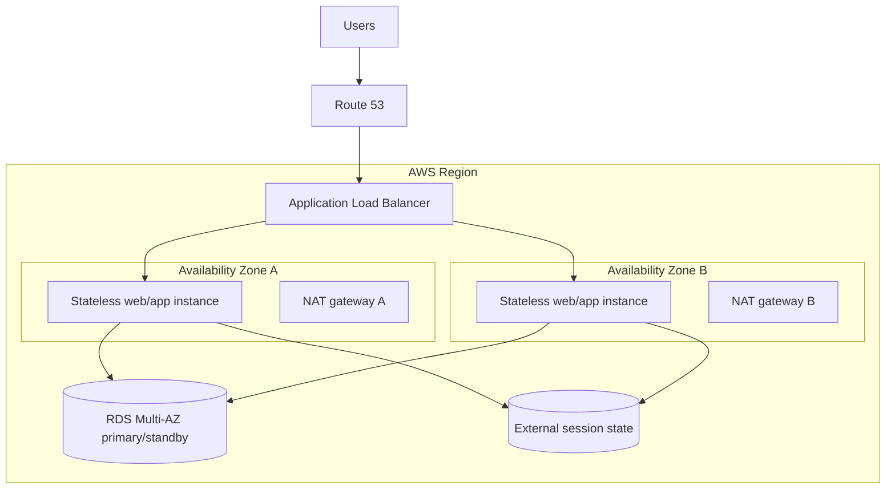

# Highly Available Web Applications

## Overview

A highly available web application removes avoidable single points of failure and continues serving useful traffic when an instance or Availability Zone becomes unavailable. High availability reduces downtime; it does not guarantee uninterrupted service or protect against every Regional, dependency, data, or deployment failure.

## Requirements

Start with business requirements rather than a service checklist:

- Which failures must the workload tolerate: instance, Availability Zone, dependency, or Region?
- What availability objective, Recovery Time Objective (RTO), and Recovery Point Objective (RPO) apply?
- Can the application degrade gracefully when a noncritical dependency fails?
- What capacity must remain after one Availability Zone is lost?
- What security, data residency, latency, and cost constraints apply?

## Multi-AZ Architecture

The load balancer and Auto Scaling group use subnets in at least two Availability Zones. Application instances remain interchangeable because durable state and sessions live outside the instances. The data tier uses a resilience mode appropriate to its engine and requirements.

## Request and Data Flow

1. Route 53 resolves the application name to the load balancer.
2. The load balancer sends a request only to a registered, healthy target.
3. Any healthy application instance can process the request.
4. The application reads or writes durable state through the database endpoint and stores sessions externally when sessions are required.
5. Metrics, logs, traces, and health signals support detection and automated recovery.

## Availability and Failure Domains

Availability Zones are isolated failure domains inside one Region. Spreading resources across them reduces the impact of a zonal failure, but only when every critical tier has a viable path in another zone.

| Component | Resilient choice | Remaining concern |
|---|---|---|
| Entry point | Load balancer enabled in multiple AZs | Bad health checks or a shared DNS/configuration error |
| Compute | Auto Scaling group across multiple AZs | Insufficient remaining capacity or an unhealthy launch template |
| Application state | Stateless instances; external session store | Session store can itself be a shared dependency |
| Database | RDS Multi-AZ or an appropriate Aurora design | Failover interruption, connection recovery, and engine behavior |
| Private egress | NAT gateway per AZ with same-AZ routing where justified | Additional hourly and processing cost |
| Deployment | Automated, incremental deployment with rollback | A defective release can affect every AZ |

One NAT gateway in one AZ may be both a failure dependency and a cross-AZ data-transfer concern for private resources in another AZ. A per-AZ design improves isolation but costs more.

## Scaling

- Horizontal scaling adds interchangeable instances and generally improves aggregate availability.
- Auto Scaling replaces unhealthy instances and adjusts capacity, but cannot fix defective code or a broken dependency.
- Target-tracking policies need realistic metrics and sufficient service quotas.
- The remaining zones must have subnet address space and capacity for the workload after an impairment.
- Caching and a content delivery network can reduce origin load, but cached data needs an explicit freshness policy.

## Data-Tier Decisions

An RDS Multi-AZ DB instance deployment maintains a standby for high availability and automatic failover. The standby is not a read-scaling target. Use read replicas or a supported Multi-AZ DB cluster/Aurora design when read scaling is required. Application clients still need sensible connection timeouts, retry limits, and reconnection behavior during failover.

Backups address recovery from corruption, deletion, and other data disasters. Replication and a standby improve availability but do not replace point-in-time recovery or tested restores.

## Failure Behavior and Recovery

| Failure | Expected behavior | Design response |
|---|---|---|
| One application instance | Load balancer stops routing to it | Auto Scaling replaces it; investigate logs and metrics |
| One Availability Zone | Healthy targets in another zone continue | Ensure surviving capacity and every tier is multi-AZ |
| Database primary | Managed failover may change the serving host behind the endpoint | Reconnect; avoid unsafe retry of non-idempotent writes |
| NAT gateway or egress path | Affected private workloads lose external egress | Use zonally aligned egress or remove internet dependency with VPC endpoints |
| Bad deployment | Healthy infrastructure may serve faulty responses | Canary/rolling deployment, alarms, and automated rollback |
| Regional disruption | Multi-AZ alone might not recover service | Add a tested Multi-Region DR strategy only when requirements justify it |

Health checks should measure the ability to serve useful work without making a noncritical dependency a reason to remove every target. Graceful degradation might preserve browsing while temporarily disabling recommendations or another optional feature.

## Security

- Put only internet-facing entry points in public subnets; keep application and data tiers private where appropriate.
- Restrict security-group paths by tier and use roles rather than embedded credentials.
- Encrypt traffic and stored data according to requirements.
- Protect public HTTP endpoints with appropriate authentication, authorization, and application-layer controls.
- Keep recovery capacity, secrets, certificates, and KMS permissions aligned across failure domains.

## Monitoring and Testing

Monitor user-visible success, latency, load-balancer target health, Auto Scaling capacity, database connections and failover signals, error rates, and dependency health. Centralize logs and correlate them with CloudTrail and AWS Config evidence when investigating operational changes.

Test instance replacement, zonal capacity assumptions, database reconnection, rollback, backup restoration, and operational runbooks. A diagram is not proof of recoverability.

## Cost Considerations

High availability adds continuously running capacity, load-balancer charges, Multi-AZ database cost, cross-AZ transfer, observability, and potentially one NAT gateway per AZ. Choose the least complex design that meets measured business requirements; Multi-Region is not automatically required for every production workload.

## CPP Exam Focus

- Availability means the workload is accessible and functioning when required.
- Auto Scaling and load balancing help distribute and replace compute capacity.
- Multiple Availability Zones reduce reliance on one data-center-scale failure domain.
- A backup is for recovery; a read replica is primarily for read scaling; Multi-AZ is primarily for availability.

## SAA Design Scenarios

- **Zonal resilience:** choose an Application Load Balancer and Auto Scaling group spanning multiple AZs, stateless instances, and a Multi-AZ data tier.
- **Read-heavy database:** keep Multi-AZ for availability and add a read-scaling mechanism rather than sending reads to a single-standby instance.
- **Private subnets lose egress when one AZ fails:** use zonally aligned NAT gateways and route tables, or replace internet paths with service endpoints where applicable.
- **Strict Regional-disaster objective:** evaluate a separate Multi-Region DR design, its data consistency, failover/failback, and operating cost.

## Common Mistakes

- Calling a single large instance highly available.
- Placing instances in two AZs while leaving the database, session store, or egress path in one AZ.
- Treating an RDS Multi-AZ standby as a read replica.
- Assuming health checks, Auto Scaling, or Multi-AZ guarantee zero downtime.
- Adding Multi-Region complexity without a business requirement and tested operating model.

## Knowledge Check

1. **Why should application instances be stateless?** Any healthy instance can serve the next request, so replacement and zonal failover do not depend on local session state.
2. **Does an RDS Multi-AZ DB instance standby serve read traffic?** No. It is maintained for high availability; select read replicas or an appropriate cluster design for read scaling.
3. **Why can one NAT gateway undermine a two-AZ application?** Private workloads can retain a dependency on the NAT gateway's AZ and may also incur cross-AZ transfer.
4. **What should happen after a target fails a health check?** The load balancer removes it from routing, Auto Scaling can replace it, and operators use telemetry to determine the root cause.
5. **When is Multi-Region justified?** When business or regulatory requirements cannot be met by a well-engineered single-Region, Multi-AZ design and the added complexity is accepted.

## Related Services

- [Elastic Load Balancing](../04-compute/elastic-load-balancing/01-overview.md)
- [EC2 Auto Scaling](../04-compute/ec2-auto-scaling/01-target-tracking-scaling.md)
- [Amazon RDS](../06-databases/amazon-rds/01-overview.md)
- [Amazon Route 53](../07-networking-and-content-delivery/amazon-route-53/01-overview.md)
- [Monitoring evidence selection](../15-comparisons-and-decision-guides/operations/01-cloudwatch-vs-cloudtrail-vs-config.md)

## References

- [AWS Well-Architected Reliability Pillar](https://docs.aws.amazon.com/wellarchitected/latest/reliability-pillar/welcome.html)
- [Deploy the workload to multiple locations](https://docs.aws.amazon.com/wellarchitected/latest/reliability-pillar/rel_fault_isolation_multiaz_region_system.html)
- [RDS Multi-AZ DB instance deployments](https://docs.aws.amazon.com/AmazonRDS/latest/UserGuide/Concepts.MultiAZSingleStandby.html)
- [Engineering resilience in a single Region](https://docs.aws.amazon.com/prescriptive-guidance/latest/aws-multi-region-fundamentals/single-region-resilience.html)

Checked: 2026-07-24.
