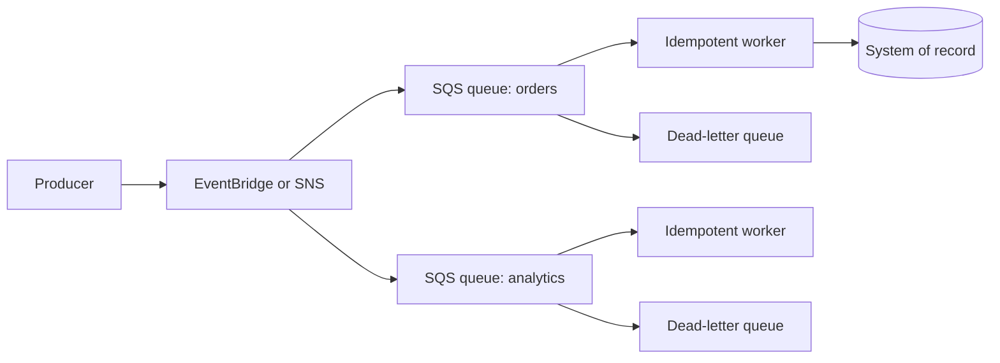

# Event-Driven and Decoupled Systems

## Overview

Decoupling prevents a producer from depending on every consumer being available at the same moment. Queues buffer work, topics fan out notifications, event buses route matching events, and workflows coordinate known steps. These services improve failure isolation only when retries, duplicates, poison messages, timeouts, and observability are designed deliberately.

## Architecture

Each consumer owns a queue so that its rate and failures do not block other consumers. A failed message moves to a dead-letter queue only after the configured receive and retry policy is exhausted.

## Service Roles

| Need | Typical choice | Resilience role |
|---|---|---|
| Buffer and pull-based processing | Amazon SQS | Absorbs bursts and lets workers process independently |
| Fanout notification | Amazon SNS | Pushes one publication to multiple subscriptions |
| Rule-based event routing | Amazon EventBridge | Routes matching events from AWS, SaaS, and custom sources |
| Explicit workflow and state | AWS Step Functions | Coordinates steps, branches, waits, retries, catches, and compensation |

Choose from delivery, ordering, retention, filtering, throughput, integration, and failure requirements—not from the word “event” alone.

## Queue-Based Load Levelling

A queue separates producer rate from consumer rate. Workers scale based on backlog and processing latency rather than forcing the producer to wait for downstream work. The queue must be bounded operationally: monitor backlog age and depth, scale consumers, and shed or throttle upstream load before an unlimited backlog violates business deadlines.

Backpressure is the system's response when consumers cannot keep up. Options include throttling producers, limiting concurrency, prioritizing work, rejecting low-value work, or degrading optional functions.

## Delivery, Duplicates, and Idempotency

Amazon SQS standard queues provide at-least-once delivery, so a consumer can receive a duplicate. An idempotent handler produces the same intended result when the same operation is processed again.

Common techniques include a business idempotency key, a conditional write, or a processed-operation record stored with the business result. “Exactly once” must be evaluated end to end; a queue feature alone does not make every downstream side effect exactly once.

## Retries, Backoff, and Jitter

Retry only transient failures and set a maximum attempt or time budget. Exponential backoff spaces repeated attempts; jitter varies their timing so many clients do not retry together. Set timeouts on remote calls and avoid retry multiplication across several layers.

Non-idempotent actions need special care. Retrying “charge card” after an ambiguous timeout can duplicate the charge unless the operation has an idempotency key and the downstream system honors it.

## Dead-Letter Queues and Replay

A dead-letter queue isolates messages that repeatedly fail. It is not an automatic repair mechanism.

- Alarm on DLQ arrivals and oldest-message age.
- Preserve enough context to diagnose the failure without exposing sensitive data.
- Fix the consumer or data problem before replay.
- Redrive at a controlled rate and keep processing idempotent.
- Define retention and ownership so failed work is not silently forgotten.

## Orchestration Versus Choreography

| Model | Behavior | Strength | Risk |
|---|---|---|---|
| Orchestration | A coordinator such as Step Functions directs known steps | Visible state, explicit branching, retry, catch, and audit trail | Coordinator and workflow definition add coupling and cost |
| Choreography | Services react to events without one central coordinator | Loose publisher/consumer coupling and easy fanout | End-to-end flow, ownership, and failure diagnosis can become difficult |

Use orchestration when the business process has an explicit sequence or compensation path. Use choreography when independent consumers should react without the producer knowing them. Hybrid designs are common.

## Partial Failure and Compensation

Distributed work rarely commits atomically across every service. Design each step so it can be retried or compensated. A saga coordinates local transactions and compensating actions, but compensation is a business action, not a universal database rollback. Record workflow state and use correlation identifiers so operators can find incomplete operations.

## Failure Behavior

| Failure | Expected behavior | Response |
|---|---|---|
| Consumer unavailable | Messages remain buffered within configured queue behavior | Scale or repair consumers; monitor age |
| Poison message | Same message repeatedly fails | Isolate in DLQ; diagnose and controlled-redrive |
| Duplicate delivery | Handler sees a prior operation again | Idempotency prevents duplicate business effect |
| Burst exceeds capacity | Backlog grows | Scale, throttle, prioritize, or degrade gracefully |
| Workflow task times out | State does not safely advance | Bounded retry, catch, compensation, or manual resolution |
| Event routed incorrectly | Wrong or missing consumer action | Test schemas/rules and monitor unmatched or failed deliveries |

## Security

- Grant producers permission only to publish or send to required destinations.
- Grant consumers permission only to receive/delete their queues and access required data.
- Encrypt messages when required and control KMS use.
- Avoid secrets and unnecessary personal data in event payloads.
- Validate event origin and schema; do not trust an event merely because it reached a bus.
- Restrict DLQ and replay permissions because failed messages can contain sensitive context.

## Observability

Use correlation IDs across producer, broker, worker, and workflow logs. Monitor queue depth, age of oldest message, receive/delete rates, DLQ arrivals, throttles, retry/catch counts, workflow failures, processing latency, and business outcomes. Trace synchronous edges where useful, but asynchronous hops also need explicit context propagation.

## Cost and Operational Trade-Offs

Costs can include requests, payload transfer, workflow state transitions, logging, tracing, KMS operations, and idle recovery capacity. Decoupling reduces temporal coupling but increases components, eventual-consistency behavior, operational ownership, and replay complexity.

## CPP Exam Focus

- SQS queues buffer work and decouple producers from consumers.
- SNS fans out messages to subscribers.
- EventBridge routes events using rules.
- Step Functions orchestrates workflows.

## SAA Design Scenarios

- **Producer traffic spikes:** place SQS between producer and workers and scale consumers from backlog signals.
- **Several independent consumers need an event:** fan out to a separate queue per consumer.
- **Known sequence with retries and compensation:** use Step Functions rather than custom coordination code.
- **Duplicate business action appears:** add end-to-end idempotency; changing retry count alone does not solve it.
- **One bad message blocks progress:** use bounded attempts and a monitored DLQ, then controlled redrive.

## Common Mistakes

- Assuming asynchronous means failure-proof.
- Retrying forever or at every layer.
- Treating a DLQ as long-term archival or automatic remediation.
- Claiming exactly-once business processing from one service feature.
- Using choreography for a process that needs clear state and compensation without adding end-to-end observability.

## Knowledge Check

1. **Why give each fanout consumer its own queue?** Each consumer gets independent buffering, scaling, retry, and failure isolation.
2. **Why must a standard-queue consumer be idempotent?** A message can be delivered more than once.
3. **What does a DLQ accomplish?** It isolates repeatedly failing work for diagnosis and controlled replay; it does not fix the cause.
4. **When is orchestration usually clearer than choreography?** When a known sequence, branching, retry, or compensation path must be visible and controlled.
5. **What metric reveals whether a queue is meeting a processing deadline?** Age of the oldest message is often more meaningful than depth alone.

## Related Services

- [Amazon SQS](../08-serverless-and-application-integration/amazon-sqs/01-overview.md)
- [Amazon EventBridge](../08-serverless-and-application-integration/amazon-eventbridge/01-overview.md)
- [AWS Step Functions](../08-serverless-and-application-integration/aws-step-functions/01-overview.md)
- [SQS vs SNS vs EventBridge](../15-comparisons-and-decision-guides/application-integration/01-sqs-vs-sns-vs-eventbridge.md)

## References

- [AWS Well-Architected workload architecture](https://docs.aws.amazon.com/wellarchitected/latest/reliability-pillar/workload-architecture.html)
- [Amazon SQS at-least-once delivery](https://docs.aws.amazon.com/AWSSimpleQueueService/latest/SQSDeveloperGuide/standard-queues-at-least-once-delivery.html)
- [Serverless failure management](https://docs.aws.amazon.com/wellarchitected/latest/serverless-applications-lens/failure-management.html)
- [Amazon SQS, Amazon SNS, or EventBridge decision guide](https://docs.aws.amazon.com/decision-guides/latest/sns-or-sqs-or-eventbridge/sns-or-sqs-or-eventbridge.html)

Checked: 2026-07-24.
