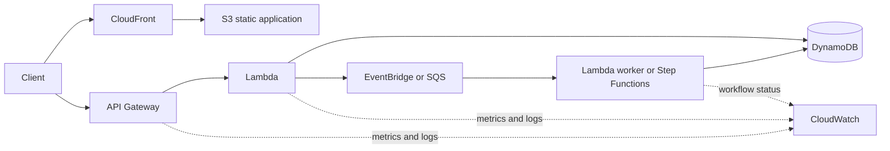

# Serverless Application Patterns

## Overview

A serverless application uses managed services so teams focus on business logic rather than provisioning servers. A common web pattern combines CloudFront and S3 for static content, API Gateway for an HTTPS API, Lambda for stateless compute, DynamoDB for durable state, and managed events or workflows for asynchronous work.

Serverless reduces infrastructure operations, but customers still own application code, identity, data protection, service configuration, quotas, observability, and failure handling.

## Architecture

The diagram separates a synchronous request path from asynchronous background processing. Not every serverless application needs every service.

## Request and Data Flow

1. CloudFront serves cached static assets from S3 where that frontend is appropriate.
2. API Gateway validates and routes HTTPS requests and can enforce authorization and throttling controls.
3. Lambda validates business input and performs bounded, stateless work.
4. DynamoDB stores durable application state.
5. Long-running or failure-prone work is handed to a queue, event bus, or workflow.
6. Metrics, structured logs, traces, and business events expose success and failure.

## API Layer

Select an API type from protocol, latency, feature, and cost requirements. Configure authorization, validation, throttling, access logging, and safe error responses. A usage plan or API key can meter clients where applicable, but an API key is not a substitute for user authorization.

Keep synchronous request chains short. Each additional dependency consumes latency budget and creates another failure mode. For work that does not need an immediate result, accept the request, record durable intent, and process asynchronously.

## Compute Layer

Lambda functions should be stateless and idempotent where retries are possible. Reuse execution environments as an optimization, but never depend on local memory or disk as the durable source of truth.

- Set timeouts to match the caller's useful waiting period.
- Control concurrency so one event source cannot exhaust capacity needed by another workload.
- Reuse connections safely and avoid creating a new downstream connection for every invocation.
- Keep deployment packages, permissions, and configuration narrow.
- Move complex multi-step coordination to a workflow when that improves visibility and recovery.

## Data Layer

DynamoDB fits key-value or document access patterns that are designed around known keys and indexes. Choose keys that distribute load and support required queries; serverless compute does not correct a hot partition or a poor data model.

Use conditional writes or transaction/idempotency records when duplicate execution must not duplicate a business effect. Define backup and point-in-time recovery requirements separately from availability. Streams can trigger downstream processing, but stream consumers must handle retry and partial failure behavior.

## Events and Workflows

- SQS buffers work and isolates consumer availability.
- SNS provides fanout to subscriptions.
- EventBridge routes events based on rules and schemas.
- Step Functions coordinates explicit states, retries, catches, waits, and compensation.

Use asynchronous processing to absorb bursts and isolate failures, but monitor message age and failed destinations. Preserve correlation and idempotency context across every hop.

## Scaling and Quotas

Managed services scale their infrastructure, but every workload still has limits and downstream capacity. API Gateway can throttle callers; Lambda concurrency can protect downstream systems; queues can buffer bursts; DynamoDB capacity mode and key design influence throughput behavior.

Monitor usage against quotas before a failover or traffic event. Scaling one tier without protecting the next tier can turn elasticity into a failure amplifier.

## Failure Behavior

Invocation models behave differently, so configure failure handling for the actual integration:

| Path | Example failure concern | Design response |
|---|---|---|
| Synchronous API | Caller times out while work may have completed | Short bounded work, idempotency key, clear status model |
| Asynchronous invocation | Function error is retried according to integration behavior | Configure destinations/DLQ where supported and alarm on failure |
| Queue event source | A failed item can be delivered again | Idempotent consumer, visibility settings, partial-batch response where supported, DLQ |
| Stream event source | Repeated record failure can impede shard progress | Bounded retry/record age, failure destination, batch isolation controls |
| Workflow | A task times out or returns a domain error | Explicit retry/catch and compensation or manual-resolution state |
| DynamoDB write | Throttling or ambiguous client result | Bounded backoff with jitter and idempotent/conditional writes |

Do not assume all Lambda failures receive the same retries or destination behavior.

## Security

- Use a separate least-privilege execution role for each function or trust boundary.
- Authorize API callers with the appropriate IAM, JWT, Cognito, or custom mechanism.
- Store secrets in Secrets Manager or an appropriate encrypted parameter store, not environment-variable source files.
- Encrypt data and event payloads when required, and constrain KMS permissions.
- Validate untrusted input and avoid leaking internal errors.
- Use private connectivity where the requirement justifies its cost and complexity.
- Record administrative API activity and protect logs from unauthorized alteration.

## Observability

Capture API latency and error rates, Lambda errors, duration, throttles and concurrency, queue backlog/age, workflow failures, DynamoDB throttling and consumed capacity, and user-visible business outcomes. Use structured logs and correlation IDs; tracing complements rather than replaces metrics and logs.

Alarm on symptoms that require action. High invocation count alone may be healthy; failed checkouts or growing message age are closer to user impact.

## Deployment and Recovery

Define infrastructure and permissions as code. Use versions or aliases and incremental deployment where appropriate, watch health signals, and automatically stop or roll back a bad release. Back up durable state, test recovery, and document how events that accumulated during an outage will be replayed safely.

## Cost Considerations

Serverless cost commonly follows requests, execution duration/resources, data storage and access, workflow transitions, logging/tracing, and data transfer. It can be efficient for variable demand, but high-volume chatty designs, excessive logs, repeated retries, and unnecessary workflow states can raise cost. Compare total cost and operational effort, not only idle compute.

## CPP Exam Focus

- API Gateway provides managed APIs; Lambda runs event-driven code; DynamoDB provides managed NoSQL data; EventBridge routes events.
- Serverless does not mean no customer responsibility.
- Pay-for-use and managed scaling are common benefits, while application security and configuration remain customer responsibilities.

## SAA Design Scenarios

- **Spiky API with short requests:** API Gateway, Lambda, and a data store designed for the access pattern.
- **Long background task:** return an accepted response and place durable work on a queue or workflow.
- **Duplicate order after retry:** use an idempotency key and conditional business write.
- **One function overloads the database:** limit concurrency, reuse connections, buffer work, or select an integration such as a managed proxy where supported.
- **Bad deployment affects users:** shift traffic incrementally, alarm on business and technical signals, and roll back.

## Common Mistakes

- Assuming managed scaling means unlimited capacity.
- Using API keys as authentication.
- Keeping durable state in a Lambda execution environment.
- Applying the same retry assumptions to synchronous, asynchronous, queue, and stream invocations.
- Building a long synchronous chain when asynchronous completion is acceptable.
- Ignoring event replay, duplicates, and downstream quotas.

## Knowledge Check

1. **Where should a Lambda function keep durable application state?** In an appropriate durable service such as DynamoDB or S3, not in its execution environment.
2. **Why can Lambda concurrency need a limit?** It protects downstream services and preserves capacity for other workloads.
3. **Does an API key authenticate a user?** No. Use an appropriate authorization mechanism; API keys primarily identify and meter API consumers where supported.
4. **Why use a queue for background work?** It records durable intent, absorbs bursts, and decouples the API's availability from worker processing.
5. **What makes retries safe?** Bounded retry behavior plus an idempotent business operation.

## Related Services

- [Amazon API Gateway](../08-serverless-and-application-integration/amazon-api-gateway/01-overview.md)
- [AWS Lambda](../04-compute/aws-lambda/01-overview.md)
- [Amazon DynamoDB](../06-databases/amazon-dynamodb/01-overview.md)
- [Amazon EventBridge](../08-serverless-and-application-integration/amazon-eventbridge/01-overview.md)
- [Event-driven and decoupled systems](03-event-driven-and-decoupled-systems.md)
- [Data-protection patterns](security/01-data-protection-patterns.md)

## References

- [Serverless Applications Lens—web application](https://docs.aws.amazon.com/wellarchitected/latest/serverless-applications-lens/web-application.html)
- [Serverless Applications Lens—foundations](https://docs.aws.amazon.com/wellarchitected/latest/serverless-applications-lens/rel-foundations.html)
- [Serverless Applications Lens—failure management](https://docs.aws.amazon.com/wellarchitected/latest/serverless-applications-lens/failure-management.html)
- [Serverless deployment approaches](https://docs.aws.amazon.com/wellarchitected/latest/serverless-applications-lens/deployment-approaches.html)

Checked: 2026-07-24.
