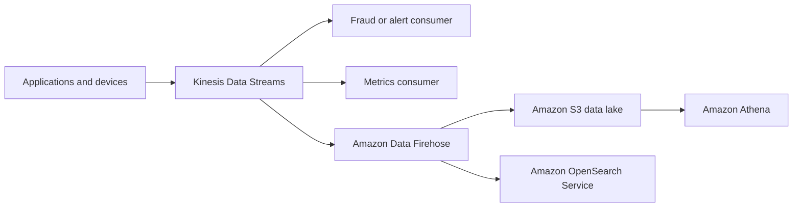

# Amazon Kinesis Data Streams and Amazon Data Firehose

## Overview

Streaming systems process a continuing flow of events such as application logs, clicks, telemetry, transactions, or device readings. Two commonly confused AWS services play different roles:

- **Amazon Kinesis Data Streams** is a durable real-time stream that applications can write to and multiple consumers can read independently.
- **Amazon Data Firehose** is a fully managed delivery service that buffers records and delivers them to configured destinations.

Amazon Data Firehose was formerly named Amazon Kinesis Data Firehose. This lesson uses the current name, verified on **2026-07-25**.

## Batch Processing vs Stream Processing

| Requirement | Batch processing | Stream processing |
|---|---|---|
| Input | A bounded collection | A continuing event flow |
| Typical trigger | Schedule or accumulated files | Record arrival or short processing windows |
| Latency goal | Minutes, hours, or longer may be acceptable | Seconds or near-real-time behavior may matter |
| Replay | Rerun the stored batch | Requires retained stream records or a durable archive |
| Operational concern | Job duration and failed partitions | Consumer lag, ordering, duplicates, backpressure, and expiry |

Amazon S3 plus scheduled AWS Glue or Amazon EMR work is a common batch pattern. Kinesis Data Streams, Data Firehose, and stream-processing consumers support streaming patterns.

## Decision Table

| Choose | When the requirement says |
|---|---|
| Kinesis Data Streams | Multiple custom consumers, retained records, replay, partition-key ordering, or custom real-time processing |
| Amazon Data Firehose | Managed buffered delivery to a supported destination with minimal consumer code |
| Both | Retain and process events in Data Streams while Data Firehose independently delivers them to an analytics destination |
| Amazon SQS | Decouple work items between application components rather than analyze a replayable event stream |
| Amazon MSK | Existing Apache Kafka clients, APIs, and ecosystem compatibility are requirements |

## Kinesis Data Streams

Producers place records into a data stream. A partition key determines how records are mapped into shards, and records with the same partition key receive ordering within that shard. Consumers retrieve records and process them independently.

Data Streams is appropriate when an application needs control over consumption. Examples include real-time fraud signals, telemetry processing, multiple analytics consumers, or an event stream that consumers may need to replay during its configured retention window.

### Capacity and scaling

Data Streams supports on-demand and provisioned capacity modes. On-demand mode manages stream capacity for changing workloads. Provisioned mode exposes shards as capacity units that the customer scales. Avoid memorizing throughput quotas: use current service quotas and metrics when designing a real workload.

Partition-key design matters. A heavily used key can concentrate traffic in one shard even when the overall stream has spare capacity. Distribute keys according to the access pattern, monitor throttling and iterator age, and scale before consumer lag exhausts the retention window.

### Ordering, replay, and delivery behavior

- Ordering is scoped to records sharing a partition key within a shard; it is not a universal total order across the stream.
- Records are retained for a configurable period. Consumers can reread available records, which supports recovery and replay.
- Consumers should tolerate retries and duplicates. Use idempotent processing when repeated effects would be harmful.
- A slow or failed consumer does not prevent a separate consumer from reading the same stream, but it can accumulate lag and eventually lose access to expired records.

## Amazon Data Firehose

Producers can send records directly to a Firehose stream, or Data Firehose can read from an existing Kinesis data stream. Data Firehose buffers incoming records and delivers batches to supported destinations such as Amazon S3, Amazon Redshift, Amazon OpenSearch Service, OpenSearch Serverless, Splunk, Apache Iceberg tables, or supported HTTP endpoints.

Data Firehose can perform managed format conversion and invoke AWS Lambda for record transformation where supported. It is a delivery service, not a general-purpose durable event log for arbitrary consumer applications.

### Buffering and latency

Delivery is buffered by time, size, and destination behavior. Therefore, “real-time delivery” does not mean that every record arrives individually or instantly. Use Kinesis Data Streams and a custom consumer when the application requires direct per-record processing and consumer control.

### Failure and duplicates

Data Firehose retries delivery according to destination configuration and can route failed data to an S3 error or backup location in supported configurations. Delivery behavior is destination-specific. AWS documents at-least-once behavior for many destinations, so downstream processing should not assume that duplicates are impossible.

## Reference Architecture

The durable stream allows independent consumers to process the same events. Data Firehose handles buffered delivery, while S3 preserves an analytical copy that Athena can query.

## Security and Governance

- Use least-privilege IAM policies for producers, consumers, stream administration, and destination roles.
- Encrypt data in transit and configure server-side encryption with AWS KMS where required.
- Keep producers and consumers on private network paths when the workload requires VPC endpoints and controlled egress.
- Protect Firehose destinations independently. A delivery role should have access only to the required bucket, prefix, domain, table, or endpoint.
- Use CloudWatch metrics and alarms for throttling, consumer lag, delivery failures, freshness, and backup/error records.
- Treat stream payloads as sensitive data when they contain identifiers, financial events, or telemetry that reveals customer behavior.

## Availability, Scaling, and Failure Design

Both services are managed Regional services, but the application still owns producer retries, consumer recovery, idempotency, quotas, destination health, and monitoring.

For Data Streams, choose partition keys carefully and make consumers recover from checkpoints without duplicating business effects. For Data Firehose, retain failed records when the destination permits it and monitor delivery age and failures. If the destination is unavailable, buffering and retries delay delivery; they do not turn the destination into a highly available system.

## Cost Fundamentals

Data Streams cost depends conceptually on capacity mode, data written and read, retention choices, and enhanced consumer features. Data Firehose cost depends mainly on data processed, optional transformations or format conversion, and destination-related charges. The destination can add storage, indexing, warehouse, query, and data-transfer costs.

Cost optimization must not remove required recovery capability. Shorter retention may cost less but reduces the recovery window. Larger delivery batches can improve destination efficiency but increase data freshness latency.

## CPP Knowledge

- **Collect and process a replayable stream with custom consumers:** Kinesis Data Streams.
- **Deliver streaming records to S3 or an analytics destination with minimal management:** Amazon Data Firehose.
- **Video from cameras:** [Kinesis Video Streams](amazon-kinesis-video-streams/01-overview.md), not Kinesis Data Streams merely because the word “stream” appears.
- **Messages as work items:** consider Amazon SQS rather than an analytics stream.

## SAA Architecture and Design

### Scenario: independent consumers

A trading application needs alerting, archival, and real-time aggregation consumers to read the same events at different rates. Choose Kinesis Data Streams. Each consumer can maintain its own progress, and an archival delivery can be added through Data Firehose.

### Scenario: managed log delivery

Web servers must place logs in S3 and OpenSearch with minimal custom code. Choose Data Firehose and plan for buffering, transformation failures, backup records, destination permissions, and possible duplicates.

### Scenario: recovery requirement

A consumer may be unavailable during deployment. Use a Data Streams retention period that exceeds the expected recovery window, monitor lag, checkpoint correctly, and make processing idempotent. Do not rely on retention as a permanent archive; deliver a long-term copy to S3.

## Common Exam Traps

- Data Firehose is not the current name “Kinesis Data Firehose.”
- Data Firehose delivery is buffered; it is not guaranteed immediate per-record delivery.
- Data Streams ordering is not global across every partition key.
- Managed services do not eliminate customer responsibility for IAM, encryption choices, consumer logic, monitoring, and destination configuration.
- A stream is not a substitute for an indefinitely retained data lake.

## Knowledge Check

1. Which service supports multiple independent custom consumers and replay within a retention window?
2. Why can Data Firehose add latency even though it handles streaming data?
3. What failure can a poor partition-key strategy create?
4. Why should a destination consumer tolerate duplicate delivery?
5. When would using Data Streams and Data Firehose together be appropriate?

## Related Lessons

- [Analytics service selection](../../15-comparisons-and-decision-guides/analytics/02-analytics-service-selection.md)
- [Amazon S3](../../05-storage/amazon-s3/01-overview.md)
- [SQS, SNS, and EventBridge selection](../../15-comparisons-and-decision-guides/application-integration/01-sqs-vs-sns-vs-eventbridge.md)
- [Data-transfer cost architecture](../../12-billing-pricing-and-support/aws-billing-and-cost-management/03-data-transfer-costs.md)

## References

Checked **2026-07-25**.

- [What is Amazon Kinesis Data Streams?](https://docs.aws.amazon.com/streams/latest/dev/introduction.html)
- [Kinesis Data Streams terminology and concepts](https://docs.aws.amazon.com/streams/latest/dev/key-concepts.html)
- [What is Amazon Data Firehose?](https://docs.aws.amazon.com/firehose/latest/dev/)
- [Data delivery in Amazon Data Firehose](https://docs.aws.amazon.com/firehose/latest/dev/basic-deliver.html)
- [Choosing an AWS analytics service](https://docs.aws.amazon.com/decision-guides/latest/analytics-on-aws-how-to-choose/analytics-on-aws-how-to-choose.html)
